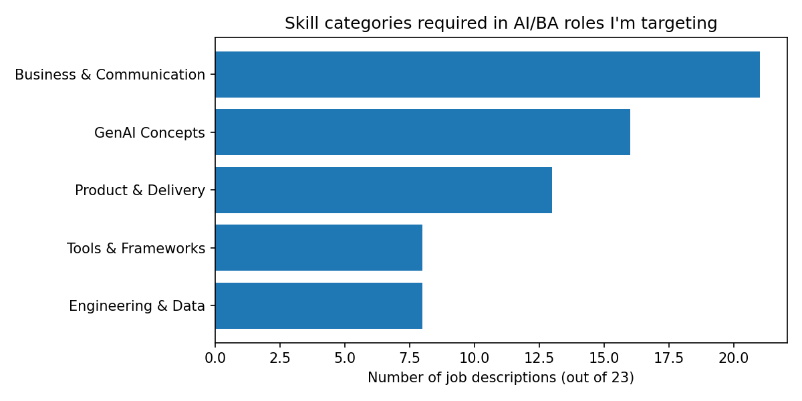

# What Do AI Business Roles Actually Require?

An LLM-powered analysis of 23 real job descriptions for AI/Business Analyst, AI Product, and AI Engineering roles, collected in October 2026.

## The question

I'm moving from marketing into AI and business analyst roles, and the advice I kept reading was contradictory. Learn Python. Don't learn Python. Learn LangChain. Learn prompting. Learn everything.

Rather than guess, I collected the job descriptions I would genuinely want — from Google, JPMorgan, Barclays, Mastercard, Standard Chartered, PwC, Capco, Fractal, HCL, Sarvam and others — and measured what they actually ask for.

## What I found

**Stakeholder management appears in 21 of 23 roles — more often than Python, RAG, LangChain, or any other technical skill combined.**

| Category | Appears in |
|---|---|
| Business & Communication | 21/23 (91%) |
| GenAI Concepts | 16/23 (70%) |
| Product & Delivery | 8/23 (35%) |
| Tools & Frameworks | 7/23 (30%) |
| Engineering & Data | 6/23 (26%) |

Top individual skills after normalisation:

| Skill | Mentions |
|---|---|
| Stakeholder management | 21 |
| Generative AI | 11 |
| Prompt engineering | 10 |
| LLMs | 9 |
| Product management | 8 |
| Workflow automation | 5 |
| Python | 5 |
| LangChain | 4 |
| AI agents | 4 |
| LangGraph | 4 |

Three things surprised me.

**The technical bar is lower than the noise suggests.** Python appears in 5 of 23 roles; stakeholder management in 21. Even JPMorgan's platform role asks only for "sufficient fluency to extract business implications from technical discussions" — explicitly not engineering depth.

**But AI literacy is now assumed.** 70% of these roles name generative AI, LLMs, RAG or agents directly. Five years ago that was a specialism; in this sample it's table stakes. Knowing *what RAG is and when it's the wrong answer* carries more weight than being able to implement it.

**The gap worth closing is the overlap.** Plenty of candidates have the business skills. Plenty have the engineering. The scarce profile is the person who has the business skills *and* can explain why an agent needs a human checkpoint. That intersection is what these 23 postings are describing, and it's narrower than either side alone.

## How it works

Job descriptions (plain text) → split into 23 records → Gemini extracts skills as structured JSON → alias map merges synonyms → categorised → counted by coverage → charted.

- **Extraction:** Gemini 3.5 Flash Lite, one call per job description, with a constrained prompt returning a JSON array of skill names
- **Normalisation:** hand-built alias map (e.g. "GenAI" → "generative AI", "retrieval augmented generation" → "RAG")
- **Categorisation:** hand-built map grouping skills into five themes
- **Metric:** category coverage — the percentage of job descriptions mentioning a category at least once, rather than raw mention counts

## Why coverage, not mention counts

My first pass counted every mention. On that metric GenAI Concepts came top with 36 mentions versus 29 for Business & Communication.

That ranking was an artefact of my own category map. GenAI scored highest because "generative AI", "LLMs", "RAG", "prompt engineering" and "AI agents" are five different names pointing at one domain — so any JD discussing AI scored four or five times, while one asking for stakeholder management scored once.

Counting each job description once per category removed the bias, and reversed the result: Business & Communication 91%, GenAI Concepts 70%.

Both numbers come from the same extraction. The metric decided the conclusion — which is the part of this project I'd want to talk about in an interview.

## Model comparison

The first run used **Gemini 3.8 Flash** and stopped at 14 of 23 when it hit the free-tier daily cap of 20 requests. Rather than finish the remaining 9 on a second model — which would have made the dataset internally inconsistent — I re-ran the complete set on **Gemini 3.5 Flash Lite**, which has a larger free quota.

Both runs are included here.

What differed: run 1 returned 10–14 skills per job description; run 2 returned 13–15, frequently sitting exactly on the upper limit of 15 that my prompt specified. The newer model appears to hug the stated ceiling more closely, which means my instruction shaped the output more than the source text did in some cases.

A proper agreement analysis — measuring where the two models extracted the same skills from the same text — is listed as next work, since run 1 covers only 14 of the 23.

## Prompt iteration

The first version of my extraction prompt missed real content. Checking one job description (Google, AI Strategist) by hand against the source text:

| In the job description | Prompt v1 | Prompt v2 |
|---|---|---|
| "no-code/low-code AI tools" | missed | captured |
| "evaluation plans and human evaluations" | missed | captured |
| "human-in-the-loop verification" | missed | still missed |

Adding two rules — *include tools and methods, not just competencies* and *check preferred qualifications line by line* — recovered two of the three. It also dropped "business strategy", which v1 had correctly captured.

That trade-off is the honest result: tightening a prompt in one direction loosens it in another. I stopped at ~85% recall rather than chase perfection, and documented what it misses.

## Limitations

- **Self-selected sample.** These are 23 roles I found appealing, not a random sample of the market. The findings describe my target roles, not AI hiring overall.
- **Extraction is imperfect.** Manual review found the model omitted "human-in-the-loop verification" even when present in the text. Recall is roughly 85% on the one job description I checked by hand.
- **The prompt shapes the output.** Asking for "5 to 15 skills" produced 13–15 for most records. A different range would produce different counts.
- **Categories are my judgement.** I decided that "workflow design" and "workflow automation" are different skills, and that "LangChain" and "LangGraph" shouldn't be merged. Someone else would group them differently and get different totals.
- **Source numbering has a gap.** My collected set is labelled JD 1–24 but contains 23 records; number 14 was lost during collection.

## Files

| File | What it is |
|---|---|
| `jd_skills_analysis.ipynb` | The full notebook, including the failed runs |
| `jds.txt` | The 23 job descriptions as collected |
| `skills_run1.json` | Gemini 3.8 Flash extraction (14/23, quota-limited) |
| `skills_run2.json` | Gemini 3.5 Flash Lite extraction (23/23, used for analysis) |
| `skill_categories.png` | Category coverage chart |
| `top_skills.png` | Top 15 individual skills |

## What I'd do next

- Expand to 100+ job descriptions so the sample supports claims about the market rather than about my preferences
- Run a second model over the same text and measure disagreement as a quality check on extraction
- Split the analysis by role family — the requirements for "AI Product Manager" and "AI Agent Developer" are clearly different, and the aggregate hides that
- Track the same roles over time to see which skills are rising

## What I learned building it

The code was the easy part. The decisions were harder: which metric to use, which skills count as the same skill, when a prompt is good enough, and what to do when the free quota runs out mid-run. Every one of those changed the final numbers.

---

*Built in Google Colab with Python, the Gemini API, and matplotlib. October 2026.*
